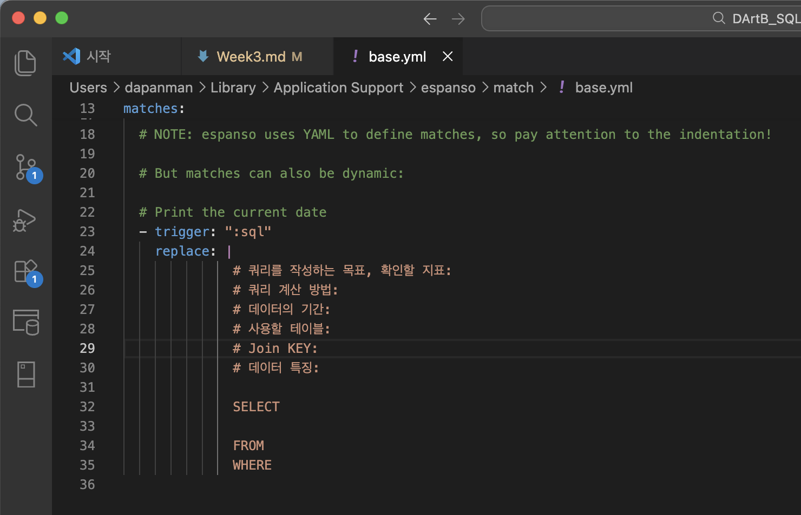
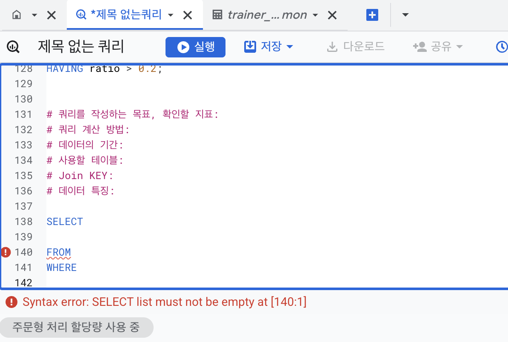
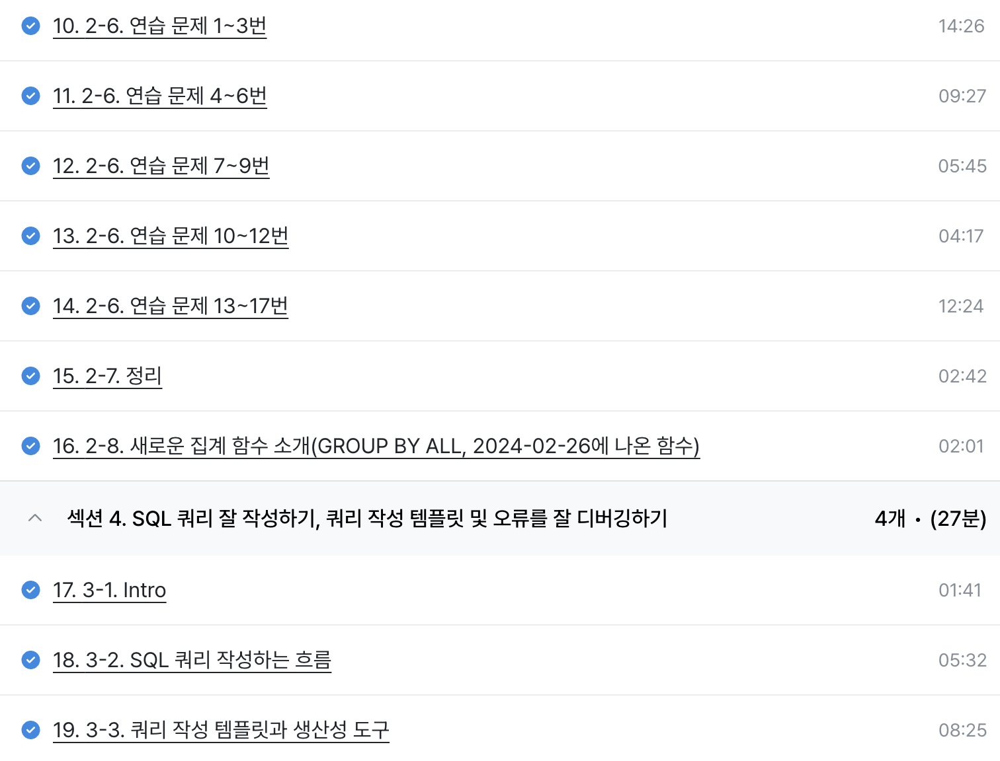

# SQL_BASIC 3주차 정규 과제 

📌SQL_BASIC 정규과제는 매주 정해진 분량의 `초보자를 위한 BigQuery(SQL) 입문` 강의를 듣고 간단한 문제를 풀면서 학습하는 것입니다. 이번주는 아래의 **SQL_Basic_3rd_TIL**에 나열된 분량을 수강하고 `학습 목표`에 맞게 공부하시면 됩니다.

**3주차 과제는 문제 풀이를 중심으로**, 강의에서 제시된 예제 문제 중 **7 문제 이상을 선택하여 직접 풀어본 뒤**, 강의 영상의 풀이와 비교해 **틀린 부분, 맞은 부분, 새롭게 배운 개념**을 구체적으로 정리해주세요. (적어도 3문제는 정리해야 합니다.) 완성된 과제는 Gihub에 업로드하고, 링크를 스프레드시트 'SQL' 시트에 입력해 제출해주세요.

**👀(수행 인증샷은 필수입니다.)** 

## SQL_BASIC_3rd

### 섹션 3. 데이터 탐색 - 조건, 추출, 요약

### 2-6. 연습문제 1~3번

### 2-6. 연습문제 7~9번

### 2-6. 연습문제 10~12번

### 2-6. 연습문제 13~17번

### 2-7. 정리 

### 2-8. 새로운 집계함수

## 섹션 4. 쿼리 잘 작성하기, 쿼리 작성 템플릿 및 오류를 잘 디버깅하기

### 3-1. INTRO

### 3-2. SQL 쿼리 작성하는 흐름

### 3-3. 쿼리 작성 템플릿과 생산성 도구 

## 🏁 강의 수강 (Study Schedule)

| 주차  | 공부 범위              | 완료 여부 |
| ----- | ---------------------- | --------- |
| 1주차 | 섹션 **1-1** ~ **2-2** | ✅         |
| 2주차 | 섹션 **2-3** ~ **2-5** | ✅         |
| 3주차 | 섹션 **2-6** ~ **3-3** | ✅         |
| 4주차 | 섹션 **3-4** ~ **4-4** | 🍽️         |
| 5주차 | 섹션 **4-4** ~ **4-9** | 🍽️         |
| 6주차 | 섹션 **5-1** ~ **5-7** | 🍽️         |
| 7주차 | 섹션 **6-1** ~ **6-6** | 🍽️         |

 

<!-- 여기까진 그대로 둬 주세요-->

---

# 1️⃣ 개념정리

## 2-6. 연습문제

~~~
✅ 학습 목표 :
* 연습문제(7문제 이상) 푼 것들 정리하기
~~~

### 🅾️ 문제1. 포켓몬중에 type2가 없는 포켓몬의 수?
~~~sql
SELECT COUNT(id) AS cnt
FROM Basic.pokemon
WHERE type2 IS NULL;
~~~
###  🅾️ 문제2. type2가 없는 포켓몬의 type1과 type1의 포켓몬수를 알려주는쿼리 (단, type1의 포켓몬 수가 큰순으로 정렬)
~~~sql
SELECT 
  type1, 
  COUNT(id) as cnt  
FROM Basic.pokemon
WHERE type2 IS NULL
GROUP BY type1
ORDER BY cnt DESC;
~~~
- 집계하는 기준이 있다면 그 기준 컬럼을 `GROUP BY`에 써야 한다

###  🅾️ 문제3. type2 상관없이 type1의 포켓몬 수를 알 수 있는 쿼리
~~~sql
SELECT 
  type1, 
  COUNT(id) as type1_cnt,
  COUNT(DISTINCT id) as type1_cnt2 
FROM Basic.pokemon
GROUP BY type1;
~~~
- 이 데이터셋의 id는 중복이 없어서 `DICSTINCT`쓰나 안 쓰나 똑같음
- Active한 유저의 수를 하루 단위로 집계하고자 할 때 이럴때는 `DISTINCT` 꼭 써줘야 함

###  🅾️ 문제4. 전설여부에 따른 포켓몬 수를 알 수 있는 쿼리
~~~sql
SELECT 
  is_legendary, 
  COUNT(id),
FROM `Basic.pokemon`
GROUP BY is_legendary;
~~~
- `GROUP BY`, `ORDER BY`절에 숫자를 입력해면 `SELECT` 절의 해당 번째 컬럼이 나옴
- 이런건 빠르게 데이터 볼 때 사용. 실제 완성된 컬럼을 만들때는 컬럼 이름 정확하게 쓰기 

###  🅾️ 문제5. 동명이인이 있는 이름?
~~~sql
SELECT
  name
FROM Basic.trainer
GROUP BY name
HAVING COUNT(name) > 1 ;
~~~

###  🅾️ 문제6. trainer 테이블에서 "Iris" 트레이너의 정보를 알 수 있는 쿼리
~~~sql
SELECT *
FROM Basic.trainer
WHERE name = "Iris";
~~~

###  🅾️ 문제7. trainer 테이블에서 "Iris", "Whitney", "Cynthia" 트레이너의 정보를 알 수 있는 쿼리를 작성
~~~sql
SELECT *
FROM Basic.trainer
WHERE name IN ("Iris", "Whitney", "Cynthia");
~~~

###  🅾️ 문제8. 전체 포켓몬 수 
~~~sql
SELECT COUNT(DISTINCT id) as pokemon_total_cnt
FROM Basic.pokemon;
~~~

###  🅾️ 문제9. 세대별로 포켓몬 수가 얼마나 되는지
~~~sql
SELECT 
  generation,
  COUNT(id)
FROM Basic.pokemon
GROUP BY generation;
~~~

###  🅾️ 문제10. type2가 존재하는 포켓몬수
~~~sql
SELECT 
  COUNT(id)
FROM Basic.pokemon
WHERE type2 IS NOT NULL;
~~~

### ❎ 문제11. type2가 있는 포켓몬 중에 제일 많은 type1
~~~SQl
SELECT 
  type1,
  COUNT(type1) as cnt
FROM Basic.pokemon
WHERE type2 IS NOT NULL
GROUP BY type1
ORDER BY cnt DESC
LIMIT 1;      
~~~
- `LIMIT` : 행수제한

### 🅾️ 문제12. 단일(하나의 타입만 있는) 타입 포켓몬 중 많은 type1
~~~sql
SELECT 
  type1,
  COUNT(id) as cnt
FROM Basic.pokemon
WHERE type2 IS NOT NULL
GROUP BY type1
ORDER BY cnt DESC
LIMIT 1;
~~~

### 🅾️ 문제13. 포켓몬의 이름에 '파'가 들어가는 포켓몬은 어떤 포켓몬?
~~~sql
SELECT kor_name
FROM Basic.pokemon
WHERE kor_name LIKE "%파%";
~~~

### 🅾️ 문제14. 뱃지가 6개 이상인 트레이너는 몇명?
~~~sql
SELECT 
  COUNT(name) as cnt
FROM Basic.trainer
WHERE badge_count >= 6;
~~~

### 🅾️ 문제15. 트레이너가 보유한 포켓몬(trainer_pokemon)이 제일 많은 트레이너?
~~~sql
SELECT 
  trainer_id,
  COUNT(pokemon_id) as cnt_pokemon
FROM `Basic.trainer_pokemon`
GROUP BY trainer_id
ORDER BY cnt_pokemon DESC
LIMIT 1;
~~~

### 🅾️ 문제16. 포켓몬을 많이 풀어준 트레이너
~~~sql
SELECT 
  trainer_id,
  COUNT(id) as cnt_released
FROM `Basic.trainer_pokemon`
WHERE status = "Released"
GROUP BY trainer_id
ORDER BY cnt_released DESC
LIMIT 1;
~~~

### ⭐️❎ 문제17.트레이너 별로 풀어준 포켓몬의 비율이 20%가 넘는 포켓몬 트레이너?
~~~sql
SELECT 
  trainer_id, 
  COUNTIF (status = "Released")/ COUNT(pokemon_id) as ratio 
FROM `Basic.trainer_pokemon`
GROUP BY trainer_id
HAVING ratio > 0.2;
~~~
- `COUNTIF` : 특정 컬럼 상태를 WHERE절 말고도 이렇게 표현 가능

 
 

## 2-8. 새로운 집계함수

~~~
✅ 학습 목표 :
* SQL 쿼리 구조를 이해할 수 있다. 
* SELECT, FROM, WHERE을 활용하는 방법을 설명할 수 있다. 
~~~

### *`GROUP BY ALL`* 함수
: GROUP BY 절에 들어갈 컬럼을 **자동으로 추론해서** 채워준다 

 
 

## 3-2. 쿼리를 작성하는 흐름

~~~
✅ 학습 목표 :
* 쿼리를 작성하는 흐름을 설명할 수 있다.
~~~

1. **지표고민**
    - 문제정의 단계
    - 어떤 문제를 해결하기 위해 데이터가 필요한가?
2. **지표 구체화** 
    - 추상적이지 않고 구체적인 지표 명시(분자, 분모 명시)
    - 정의나 이름을 구체적으로
3. **지표 탐색** 
    - 유사한 문제를 해결한 케이스가 있나 확인  
    -> 존재한다면 해당 쿼리 리뷰  
    -> 없다면 구글, AI에 검색 등
4. **쿼리 작성**
    - 데이터가 들어있는 테이블을 찾고 ERD 등을 진행
    - 테이블이 2개 이상인 경우 JOIN 방법 고민
5. **데이터 정합성 확인**
    - 예상한 결과와 동일한지 확인
6. **쿼리 가독성**
    - 나중을 위해서 읽기쉽게 깔끔하게 쿼리작성
7. **쿼리 저장** 
    - 쿼리는 재사용되므로 문서로 저장해둔다

 
 

## 3-3. 쿼리 작성 템플릿과 생산성 도구

~~~
✅ 학습 목표 :
* 생산성 도구를 만들 수 있다.
~~~

### [ 쿼리 작성 템플릿 ]
~~~SQL
#쿼리를 작성하는 목표, 확인할 지표:
#쿼리 계산 방법: 
#데이터의 기간: 
#사용할 테이블:
#Join KEY:
#데이터 특징:

SELECT

FROM
WHERE
~~~

### [ **생산성 도구** ]
: 업무 효율과 일상적인 작업 완료를 돕는 디지털 도구(앱/소프트웨어)로 위의 쿼리작성 템플릿을 좀더 효율적, 효과적으로 작성 및 저장하게 해줌

### 🛜 **Espanso**
: 특정 단어를 입력하면 원하는 문장(템플릿)으로 변경  
=> 특정 단어를 감지해 정의된 것으로 바꾸는 방식  
**Ex)** `trigger : "date"` -> match -> `replace : "2026.03.19"`. 

 
 

---

# 2️⃣ 학습 인증란

 
 

---

# 3️⃣ 확인문제

## 문제 1

> **🧚Q. 포켓몬 연구에 흥미를 느낀 혜인은 각 타입(type1)별 평균 공격력(attack)을 비교해보고 싶었습니다.**
>
> 그래서 다음과 같은 필요한 정보를 미리 정리해보았습니다. 

~~~
조건 : attack이 50 이상인 포켓몬만 포함
보고 싶은 컬럼 : type1
집계 내용 : 각 type1 별 평균 공격력
정렬 기준 : 평균 공격력을 기준으로 내림차순 정렬
~~~

> **이 목표를 바탕으로 혜인은 아래와 같은 쿼리를 작성했지만, 일부 SQL 문법 요소를 빼먹었습니다. 비어 있는 부분인 ㄱ, ㄴ, ㄷ, ㄹ 에 들어갈 알맞은 SQL 구문을 채워보세요:**

~~~sql
SELECT type1, (ㄱ)
FROM pokemon
(ㄴ) attack >= 50
(ㄷ) type1
ORDER BY (ㄱ) (ㄹ);
~~~

~~~
ㄱ : AVG(attack)
ㄴ : WHERE 
ㄷ : GROUP BY 
ㄹ : DESC
~~~

### 🎉 수고하셨습니다.
