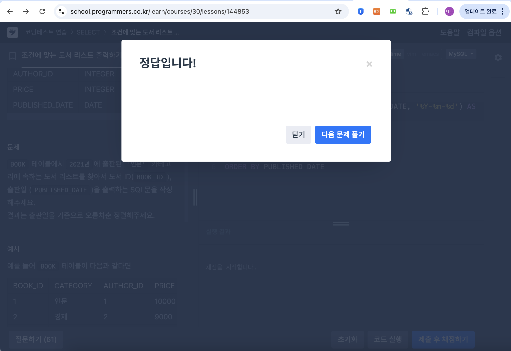

# SQL_BASIC 4주차 정규 과제 

📌SQL_BASIC 정규과제는 매주 정해진 분량의 `초보자를 위한 BigQuery(SQL) 입문` 강의를 듣고 간단한 문제를 풀면서 학습하는 것입니다. 이번주는 아래의 **SQL_Basic_4th_TIL**에 나열된 분량을 수강하고 `학습 목표`에 맞게 공부하시면 됩니다.

**4주차 과제부터는 강의 내용을 정리하는 것과 함께, 프로그래머스에서 제공하는 SQL 문제를 직접 풀어보는 실습도 병행합니다.** 강의에서는 **배운 내용을 정리하고 주요 쿼리 예제를 정리**하며, 프로그래머스 문제는 **직접 풀어본 뒤 풀이 과정과 결과, 배운 점을 함께 기록**해주세요. 완성된 과제는 Github에 업로드하고, 링크를 스프레드시트 'SQL' 시트에 입력해 제출해주세요.

**👀(수행 인증샷은 필수입니다.)** 

## SQL_BASIC_4th

## 섹션 4. 쿼리 잘 작성하기, 쿼리 작성 템플릿 및 오류를 잘 디버깅하기

### 3-4. 오류를 잘 디버깅하는 방법

## 섹션 5. 데이터 탐색 - 변환

### 4-1. INTRO  

### 4-2. 데이터 타입과 데이터 변환(CAST, SAFE_CAST)


### 4-3. 문자열 함수(CONCAT, SPLIT, REPLACE, TRIM, UPPER)

### 4-4. 날짜 및 시간 데이터 이해하기(1) (타임존, UTC, Millisecond, TIMESTAMP/DATETIME)


## 🏁 강의 수강 (Study Schedule)

| 주차  | 공부 범위              | 완료 여부 |
| ----- | ---------------------- | --------- |
| 1주차 | 섹션 **1-1** ~ **2-2** | ✅         |
| 2주차 | 섹션 **2-3** ~ **2-5** | ✅         |
| 3주차 | 섹션 **2-6** ~ **3-3** | ✅         |
| 4주차 | 섹션 **3-4** ~ **4-4** | ✅         |
| 5주차 | 섹션 **4-4** ~ **4-9** | 🍽️         |
| 6주차 | 섹션 **5-1** ~ **5-7** | 🍽️         |
| 7주차 | 섹션 **6-1** ~ **6-6** | 🍽️         |

<br>

<!-- 여기까진 그대로 둬 주세요-->

---

# 1️⃣ 개념정리

## 3-4. 오류를 디버깅하는 방법

~~~
✅ 학습 목표 :
* 오류의 정의에 대해 설명할 수 있다. 
* 오류 메시지를 보고 디버깅이라는 과정을 수행할 수 있다. 
~~~
> ⚠️ <u>***오류 메세지가 알려주고자 하는 것***</u>  
> **길잡이 역할** : "현재 작성한 방식으로 하면 답을 얻을 수 없어요"  
> **문제 진단** : "이 부분에 문제가 되어요"  
> 오류가 발생했다고 당황하기 보다는 더 좋을 길로 나아가는 관점 가지기

### [ BigQuery Error ]
***`Syntax Error`*** : 대표적인 오류 카테고리 (문법을 지키지 않아 생기는 오류)
- Error messgae를 보고 번역, 해석한 후 해결 방법 찾아보기  
  \>  구글 검색 / ChatGPT 질문 / 지인, 커뮤니티에 질문  
<br>

### **[ 대표적인 BigQuery Error 예시 ]**  
> ***SELECT list must not be empty at [10:1]***
- 밑줄(오류표시)가 뜨는 위아래 줄 살펴보기
- SELECT 절과 FROM 절 사이에 컬럼이 지정되지 않아서 생긴 오류  
<br>

> ***Number of arguments does not match for aggregate function COUNT***
```SQL
SELECT 
  COUNT(id, kor_name)
FROM basic.pokemon
```
- COUNT 집계함수 안에는 하나의 컬럼만 명시 가능  
<br>  

> ***SELECT list expression references column type1 a which is neither grouped not aggregated***
```SQL
SELECT 
  type1, 
  COUNT(id) AS cnt
FROM basic.pokemon
```
- GROUP BY절에 적절한 컬럼을 명시하지 않았다는 의미
- `GROUP BY type1` 코드 추가해 줘여함  
<br>

> ***Syntax Error: Expected end of input but got keyword SELECT***
```SQL
SELECT 
  type1, 
  COUNT(id) AS cnt
FROM basic.pokemon
GROUP BY type1

SELECT *
FROM basic.trainer
```
- 쿼리를 여러개 작성할떄는 쿼리끝에 세미 콜론(;) 넣어줘야함
- 이런 경우 우선 SELECT 근처 확인하고 오류 찾아보면 됨  
<br>

> ***Syntax Error: Expected end of input but got keyword WHERE ar [5:1]***
```SQL
SELECT 
  *
FROM basic.trainer LIMIT 10
WHERE 
  id = 3
```
- LIMIT을 아래로 옮기거나 삭제하기  
<br>

> ***Syntax Error: Expected ")" but got end of script ar [8:11]***
```SQL
SELECT 
  name, 
FROM (
  `SELECT
    *
    FROM basic.trainer
    WHERE id=3
```
- 괄호로 해당 쿼리 닫아주어야 함

<br>
<br>
<br>


## 4-1. INTRO

**[ 이번 섹션 5에서 다룰 내용 ]**  

✅ 데이터 탐색 : 변환   
✅ 자료형에 따른 여러 함수 : 문자열 / 날짜 및 시간 데이터   
✅ 조건문 함수  
✅ BigQuery 공식 문서 확인하는 방법  
<br>
<br>
<br>


## 4-2. 데이터 타입과 데이터 변환(CAST, SAFE_CAST)

~~~
✅ 학습 목표 :
* 데이터 타입의 종류를 설명할 수 있다. 
* 데이터 타입을 변환하는 방법을 설명할 수 있다. 
~~~
***"데이터 타입에 따라 다양한 함수가 존재 이를 변환시킬 수 있다!"***  
\> SELECT문 + WHERE의 조건문에서 사용할 수 있음

### **[ 데이터 타입 종류 ]**
| 데이터 타입 | 예시   |
| -------- | ----- | 
| 숫자 | 1, 3.1234 |
| 문자 | 나, 데이터 | 
| 시간, 날짜 | 2026-03-25 | 
| 부울 | 참/거짓 |   
<br>

### **[ 데이터 타입이 중요한 이유 ]**  
*"보이는 것과 저장된 것의 차이가 존재한다!"*
- 엑셀에서 보면 빈 값 : NULL 일수도, ""일수도  
- 1 : 숫자1 일수도, 문자 "1"일수도
- 2023-12-31 : date 2023-1231 일수도, 문자 "2023-12-31"일수도  

\>>> 즉, 내 생각과 다른 경우 **데이터의 타입을 서로 변경** 해야함
<br>
 
### **`CAST`** : 자료 타입을 변경하는 함수
```sql
SELECT
  CAST(1 AS STRING)  
```
숫자1을 문자 1로 변경하겠다는 의미  
<br>

> ***애초에 변경이 불가능한 형태라면?***
```sql
SELECT
  CAST("정다나" AS INT64)
```
오류가 발생해서 변경 불가능 하다  
<br>

> ***안전하게 데이터 타입 변경하기***
```sql
SELECT
  SAFE_CAST("정다나" AS INT64)
```
함수 변환에 실패한 경우 NULL 반환된다  


**[ 여러가지 수학함수 ]**  
암기할 필요 없으며 필요할 때 마다 찾기!
https://docs.cloud.google.com/bigquery/docs/reference/standard-sql/mathematical_functions  

+) ***TIP***
만약 나누기를 할때 x,y중 **하나라도 0인 경우, 그냥 나누면 zero error 발생**  
따라서 나누기를 할 경우 x/y 대신 **`SAFE_DIVIDE(x,y)`** 사용하자~    


<br>
<br>
<br>


## 4-3. 문자열 함수(CONCAT, SPLIT, REPLACE, TRIM, UPPER)

~~~
✅ 학습 목표 :
* 문자열 함수들의 종류를 이해하고 어떠한 상황에서 사용하는지 설명할 수 있다. 
~~~
### **[ 문자열(STRING) 함수]**  
: 따옴표로 나타나지는 형태 &nbsp;&nbsp; ex) "다트비"   
| 연산 | input | output | 함수이름 | 
| --- | ----- | ------ | ------ | 
| 문자열 붙이기 | "안녕" "하세요" | "안녕하세요" | `CONCAT` |
| 문자열 분리하기 | "가, 나, 다, 라" | "가" "나" "다" "라" | `SPLIT` |
| 특정단어 수정하기 | "안녕하세요" | "실천하세요" | `REPLACE` |
| 문자열 자르기 | "안녕하세요" | "안녕" | `TRIM` |
| 영어 대문자 변환 | "ab" | "AB" | `UPPER`| 
<br> 

**`CONCAT`**
```sql
SELECT
  CONCAT("안녕", "하세요", "?") AS result;
```
\> 출력결과 : 안녕하세요?  
- CONCAT 인자로 STRING이나 숫자를 넣을 떄는 데이터를 직접 넣어준 것 -> FROM이 없어도 실행됨    

**`SPLIT`**
```sql
SELECT
  SPLIT("가, 나, 다, 라", ",") AS result;
```
\> 출력결과 : 가 /  나/  다/  라
- 출력결과 형태는 배열(array)
- "," : 쉼표를 기준으로 쪼개준다는 의미
- `SPLIT(원본문자열, 나눌 기준이 되는 문자)`
- 뛰어쓰기된 부분까지 출력되므로 진짜 가나다라만 각각 출력하고 싶다면 ", "로 SPLIT 하면됨   

**`REPLACE`**
```sql
SELECT
  REPLACE("안녕하세요", "안녕", "실천") AS result;
```
\> 출력결과 : 실천하세요
- `REPLACE(원본 문자열, 찾을 단어, 교체할 단어)`   

**`TRIM`**
```sql
SELECT
  TRIM("안녕하세요", "하세요") AS result;
```
\> 출력결과 : 안녕
- `TRIM(원본 문자열, 자를단어)`   

**`UPPER`**
```sql
SELECT
  UPPER("abc") AS result;
```
\> 출력결과 : ABC  
- 어떤 데이터는 이름이 Dana, 어떤 데이터는 dana 이렇게 저장되어있을 수 있음
- 모두 대문자로 변경해서 같은지 체크해야 할 수 있음   

<br> 
<br> 
<br> 


## 4-4. 날짜 및 시간 데이터 이해하기(1) (타임존, UTC, Millisecond, TIMESTAMP/DATETIME)

~~~
✅ 학습 목표 :
* 날짜 및 시간 데이터 타입과 UTC의 개념을 설명할 수 있다. 
* DATE, DATETIME, TIMESTAMP 에 대해서 설명할 수 있다.
* 시간함수들의 종류와 시간의 차이를 추출하는 방법을 설명할 수 있다. 
~~~

> ***날짜 및 시간 데이터의 핵심***  
> 1. 날짜 및 시간 데이터 타입 파악하기 : DATE, DATETIME, TIMESTAMP
> 2. 날짜 및 시간 데이터 관련 알면 좋은 내용 : UTC, Millisecond
> 3. 날짜 및 시간 데이터 타입 변환하기
> 4. 시간함수(두 시간의 차이, 특정 부분 추출하기)   
<br> 


### **[ 시간 데이터 타입 ]**  
`DATE`  
: DATE만 표시하는 데이터  &nbsp; &nbsp;  *ex) 2023-12-31*  
`DATETIME`  
: DATE와 TIME까지 표시하는 데이터, TIME ZONE 정보 없음   &nbsp; &nbsp;  *ex) 2023-12-31  14:00:00*  
`TIME`  
: 날짜와 무관하게 시간만 표시하는 데이터  &nbsp; &nbsp;  *ex) 23:59:59.00*   
`TIMESTAMP`  
: UTC로부터 경과한 시간을 나타내는 값. Time Zone 정보가 있음  
*ex) 2023-12-31 14:00:00 UTC*  
<br>  


### ➕ **[ 타임존 ]**  
`GMT` : Greenwich Mean Time   
- 영국의 그리니치 천문대(경도 0도)를 기준으로 지역에 따른 시간의 차이를 조정하기 위해 생긴 시간의 구분선   

**`UTC`** : Universal Time Coordinated  
- 국제적인 효준 시간 / 협정 세계시
- 현재 더 일반적으로 사용되는 방식  
- GMT와 계산방법에 차이가 존재하긴 하나 값 차이가 크지 않아 일반적으로 UTC 사용 권장됨   
<br> 


### ➕ **[ 시간 데이터 다루기 ]**  
`milliseconds(ms)`   
- 우리가 아는 초보다 더 짧은 시간 단위
- 천분의 1초 ( 1,000 ms = 1초 ) 
- 빠른 반응이 필요한 분야에서 사용

**`microseconds`** 
- 1/1,000,000초 

```sql
SELECT
  TIMESTAMP_MILLIS(1704176819711) AS milli_to_timestamp
  TIMESTAMP_MICROS(1704176819711000) AS micro_to_timestamp
  DATETIME(TIMESTAMP_MICROS(1704176819711000)) AS datetime
  DATETIME(TIMESTAMP_MICROS(1704176819711000), 'Asia/Seoul') AS datetime;
```
- ***Asia/Seoul(타임존) 붙여줘야 DATETIME으로 적절하게 훌력된다***  
<br>


### ➕ **[ TIMESTAMP와 DATETIME 비교 ]**  
> *24년 1월 18일 20시 55분(한국시간)에 실행*  
```sql
SELECT
  CURRENT_TIMESTAMP() AS timestamp_col,
  DATETIME(CURRENT_TIMESTAMP(), 'Asia/Seoul') AS datetime_col
```
\> 출력결과 비교
| timestamp_col | datetime_col | 
| ------------- | ------------ | 
| 2024-01-18 11:55:11.537268 UTC | 2024-01-18T 20:55:11.536268 |
| UTC라고 나옴 | T가 나옴(TIME을 의미) | 
| 한국시간 -9시간 | 한국 zone 사용시 한국 시간과 동일 | 


<br>
<br>
<br>

---

# 2️⃣ 확인문제 & 문제 인증

## 프로그래머스 문제 

> 조건에 맞는 도서 리스트 출력하기
>
> **먼저 문제를 풀고 난 이후에 확인 문제를 확인해주세요**
>
> 문제 링크 
>
> :  https://school.programmers.co.kr/learn/courses/30/lessons/144853  


```sql
SELECT BOOK_ID, DATE_FORMAT(PUBLISHED_DATE, '%Y-%m-%d') AS PUBLISHED_DATE
FROM BOOK
WHERE 
    CATEGORY = '인문'
    AND YEAR(PUBLISHED_DATE) = 2021
ORDER BY PUBLISHED_DATE
```
```
💬 note1.
PUBLISHED_DATE의 데이터 타입은 DATE라서 날짜 전체의 정보를 담고 있다. 
하지만 내가 필요한 정보는 "년" 정보 이므로 YEAR을 사용해서 해당 정보만 추출해야 한다.
💬 note2.
SELECT 절에서 PUBLISHED_DATE를 나타내려고 할 때 날짜 형식을 맞춰주어야 한다. 
단순 값만 맞다고 같은 데이터가 아니라 형식까지 일치시키게 해야한다
```
<br>
<br>


## 문제 1

> **🧚Q. 프로그래머스 문제를 풀던 규서는 여러 번의 시행착오 끝에 결국 혼자 해결하기 어려워 오류 메시지를 공유하며 도움을 요청했습니다. 여러분들이 오류 메시지를 확인하고, 해당 SQL 쿼리에서 어떤 부분이 잘못되었는지 오류 메시지를 해석하고 찾아 설명해주세요.**

~~~sql
# 조건에 맞는 도서 리스트 출력하기
# 규서의 SQL 첫 번째 풀이
SELECT BOOK_ID, PUBLISHED_DATE
FROM BOOK
WHERE CATEGORY = '인문'
  AND YEAR(PUBLISHED_DATE, 2021);
  
오류 메시지 : Error: Number of arguments does not match for function YEAR
~~~


~~~
오류 메시지를 해석하자면 YEAR() 함수에 전달된 인자의 개수가 잘못되었다는 뜻! 
YEAR() 함수는 날짜에서 연도를 추출하는 함수이기에 YEAR(PUBLISHED_DATE) 형태가 적절하고
원하는 조건을 걸어주기 위해서는 YEAR(PUBLISHED_DATE) = 2021 이라고 표현해야 한다.
~~~


### 🎉 수고하셨습니다.
