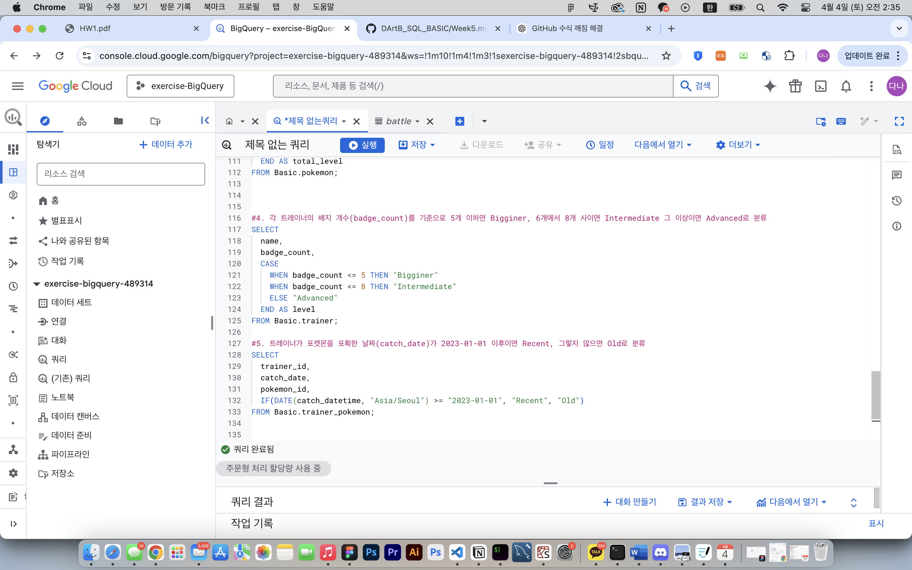

# SQL_BASIC 5주차 정규 과제 

📌SQL_BASIC 정규과제는 매주 정해진 분량의 `초보자를 위한 BigQuery(SQL) 입문` 강의를 듣고 간단한 문제를 풀면서 학습하는 것입니다. 이번주는 아래의 **SQL_Basic_5th_TIL**에 나열된 분량을 수강하고 `학습 목표`에 맞게 공부하시면 됩니다.

**5주차 과제는 문제 풀이를 중심으로**, 강의에서 제시된 예제 문제 중 **3 문제 이상을 선택하여 직접 풀어본 뒤**, 강의 영상의 풀이와 비교해 **틀린 부분, 맞은 부분, 새롭게 배운 개념**을 구체적으로 정리해주세요. (적어도 4문제는 정리해야 합니다.) 완성된 과제는 Github에 업로드하고, 링크를 스프레드시트 'SQL' 시트에 입력해 제출해주세요.

**👀(수행 인증샷은 필수입니다.)** 


## SQL_BASIC_5th

### 섹션 5. 데이터 탐색 - 변환

### 4-4. 날짜 및 시간 데이터 이해하기(2) (EXTRACT, DATETIME_TRUNC, PARSE_DATETIME, FROMAT_DATETIME)

### 4-5. 시간 데이터 연습문제 1~2번

### 4-5. 시간 데이터 연습문제 3~5번

### 4-6. 조건문 (CASE WHEN, IF)

### 4-7. 조건문 연습 문제

### 4-8. 정리

### 4-9. BigQuery 공식 문서 확인하는 법

(강의에서 연습문제가 많아서 따로 프로그래머스 문제 과제는 없습니다.)


## 🏁 강의 수강 (Study Schedule)

| 주차  | 공부 범위              | 완료 여부 |
| ----- | ---------------------- | --------- |
| 1주차 | 섹션 **1-1** ~ **2-2** | ✅         |
| 2주차 | 섹션 **2-3** ~ **2-5** | ✅         |
| 3주차 | 섹션 **2-6** ~ **3-3** | ✅         |
| 4주차 | 섹션 **3-4** ~ **4-4** | ✅         |
| 5주차 | 섹션 **4-4** ~ **4-9** | ✅         |
| 6주차 | 섹션 **5-1** ~ **5-7** | 🍽️         |
| 7주차 | 섹션 **6-1** ~ **6-6** | 🍽️         |

<br>


<!-- 여기까진 그대로 둬 주세요-->

---

## 4-4. 날짜 및 시간 데이터 이해하기(2) (EXTRACT, DATETIME_TRUNC, PARSE_DATETIME, FROMAT_DATETIME)

~~~
✅ 학습 목표 :
* 날짜 및 시간 데이터에 대해서 더 자세히 설명할 수 있다. 
* CURRENT_TIME, EXTRACT, DATETIME_TRUNC, PARSE_DATETIME, FROMAT_DATETIME 을 설명할 수 있다. 
~~~

### `CURRENT_DATETIME`
> `CURRENT_DATETIME([time_zone])` : 현재 DATETIME 출력   

| 쿼리 | 출력결과 | 
| --- | -----  |
| CURRENT_DATE() |2024-01-22 | 
| CURRENT_DATE("Asia/Seoul") | 2024-01-22 |
| CURRENT_DATETIME() |2024-01-22T05:01:42.052090|  
| CURRENT_DATETIME("Asia/Seoul") | 2024-01-22T14:01:42.052090 | 
<br>

### `EXTRACT`
> `EXTRACT(part FROM datetime)` : DATETIME에서 특정 부분만 추출하고 싶은 경우  
- ***part에 들어갈 수 있는 형식***  
: MICROSECOND, MILLISECOND, SECOND, MINUTE, HOUR, DAY, WEEK, MONTH 등 거의 대부분의 형식


| 쿼리 | 출력결과 | 
| --- | -----  |
| EXTRACT(**DATE** FROM DATETIME '2024-01-02 14:00:00') |2024-01-02 | 
| EXTRACT(**YEAR** FROM DATETIME '2024-01-02 14:00:00') | 2024 |
| EXTRACT(**MONTH** FROM DATETIME '2024-01-02 14:00:00') |1|  
| EXTRACT(**DAY** FROM DATETIME '2024-01-02 14:00:00') | 2 | 
| EXTRACT(**HOUR** FROM DATETIME '2024-01-02 14:00:00') | 14| 
| EXTRACT(**MINUTE** FROM DATETIME '2024-01-02 14:00:00') | 0|   


☑️ ***요일을 추출하고 싶은 경우*** : ***`DAYOFWEEK`***  
: 한 주의 첫날이 일요일인 [1,7] 범위의 값을 반환  
<br>

### `DATETIME_TRUNC`
> `DATETIME_TRUNC(datetime_expression, datetime_part)` : 일정 부분만 남기고 싶은 경우


| 쿼리 | 출력결과 | 
| --- | -----  |
| DATETIME TRUNC(DATETIME "2024-03-02 14:42:13", **DAY**) |2024-03-02T00:00:00 | 
| DATETIME TRUNC(DATETIME "2024-03-02 14:42:13", **YEAR**) | 2024-01-01T00:00:00 |
| DATETIME TRUNC(DATETIME "2024-03-02 14:42:13", **MONTH**) |2024-03-01T00:00:00|  
| DATETIME_TRUNC(DATETIME "2024-03-02 14:42:13", **HOUR**) | 2024-03-02T14:00:00 | 

<br>

### `PARSE_DATETIME`
> `PARSE_DATETIME('문자열형태', 'DATETIME문자열')` : 문자열로 저장된 DATETIM을 DATETIME 타입으로 변경
```sql
PARSE_DATETIME('%Y-%m-%d %H:%M:%S', '2024-01-01 12:35:35')
```
<br>

### `FORMAT_DATETIME`
> `PARSE_DATETIME('%c', 'DATETIME')` : DATETIME 타입 데이터를 특정형태의 문자열 데이터로 변환

<br>

### `LAST_DAY`
> `PARSE_DATETIME(DATETIME)` : 마지막 날을 알고싶은 경우
- *Default* : `MONTH`

| 쿼리 | 출력결과 | 
| --- | -----  |
| LAST_DAY(DATETIME '2024-01-03 15:30:00') |2024-01-31 | 
| LAST_DAY(DATETIME '2024-01-03 15:30:00', MONTH) | 2024-01-31 |
| LAST DAY (DATETIME '2024-01-03 15:30:00', WEEK) |2024-01-06|  
| LAST DAY (DATETIME '2024-01-03 15:30:00', WEEK(SUNDAY)) | 2024-01-06 | 
|LAST DAY(DATETIME '2024-01-03 15:30:00'. WEEK(MONDAY))| 2024-01-07 | 

<br>

### `DATETIME_DIFF`
> `DATETIME_DIFF(첫 DATETIME, 두번째 DATETIME, 궁금한 차이)` : 두 DATETIME의 차이를 알고 싶은 경우  
```sql
SELECT
   DATETIME_DIFF(first_datetime, second_datetime, DAY), 
   DATETIME_DIFF(second_datetime, first_datetime, DAY),
   DATETIME_DIFF(first_datetime, second_datetime, MONTH),
   DATETIME_DIFF(first_datetime, second_datetime, WEEK),
FROM (SELECT
      DATETIME "2024-04-02 10:20:00" AS first_datetime,
      DATETIME "2021-01-01 15")
```
|  | 출력결과 | 
|-- | ---- | 
| 1 | 1187 |  
| 2 | -1187 | 
| 3 | 39 | 
| 4 | 170 | 

<br>
<br>
<br>


## 4-6. 조건문(CASE WHEN, IF)

~~~
✅ 학습 목표 :
* 조건문 함수의 기능을 이해하고, 설명할 수 있다. 
~~~

### 조건문
: 만약 어떤 조건이 충족되면, 어떤 행동을 하자라고 선언
- 조건에 따른 분기 처리가 필요한 경우
- 조건에 따라 다른 값을 표시하고 싶을 때  
- 특정 카테고리를 하나로 합치는 전처리를 하고싶을 때 

➡️ `CASE WHEN`, `IF`를 사용하여 나타냄

<br>

### `CASE WHEN`
: **여러 조건이 있을 경우 유용**
```sql
SELECT
   CASE 
      WHEN 조건1 THEN 조건1이 참이 경우의 결과
      WHEN 조건2 THEN 조건2이 참이 경우의 결과
      ELSE 그 외 조건일 경우의 결과
   END AS 새로운 컬럼 이름
```  
<br>

> ✅ ***EXAMPLE 1)***   
> *Rock타입과 Ground타입이 비슷함으로 이를 합친 "Rock&Ground" 타입을 새로 만든다면?*
```sql
SELECT 
   new_type1,
   COUNT(DISTINCT id) as cnt
FROM(
   SELECT 
      CASE 
         WHEN ( type1 IN ("Rock","Ground") OR type2 IN ("Rock","Ground")) THEN "Rock&Ground"
         ELSE type1
         END AS new_type1
   FROM Basic.pokemon
)
GROUP BY new_type1
```
<br>

⚠️ <u>***CASE WHEN에서 순서에 주의!***</u>
> ✅ ***EXAMPLE 2)***   
> *각 포켓몬의 공격력(attack)을 기주능로 50이상이면 Strong, 100이상이면 Very Stoung, 그 이하면 Weak로 분류*
```sql
SELECT 
  eng_name, 
  attack,
  CASE
    WHEN attack >= 100 THEN 'Very Strong'
    WHEN attack >= 50 THEN 'Strong'
    ELSE 'Weak'
  END AS attack_level
FROM Basic.pokemon;
```
- SQL에서 CASE WHEN을 해석할 때, 첫 조건 부터 읽고 해당안하면 pass 하는 형태
- 즉, 조건1, 조건2에 둘다 해당하는 경우 앞선 순서를 따름

<br>

### `IF`
: **단일 조건일 경우 유용**
```sql
SELECT 
   IF (조건문, True일때의 값, False일때의 값) AS 새 컬럼명
``` 


<br>
<br>


## 4-5. 시간 데이터 연습문제 & 4-7. 조건문 연습 문제

~~~
✅ 학습 목표 :
* 4-5, 4-7 각각에서 두 문제 이상 (최소 4문제) 푼 내용 정리하기
~~~

### 4-5-1. 시간데이터 연습문제
> 1️⃣ ***트레이너가 포켓몬을 포획한 날짜(catch_date)를 기준으로, 2023년 1월에 포획한 포켓몬의 수를 계산해주세요***  
```sql
# 데이터 검증
SELECT 
   catch_date, 
   DATE(DATETIME(catch_datetime, "Asia/Seoul")) 
FROM Basic.trainer_pokemon
```
- 주어진 데이터셋에서 컬럼명은 `catch_datetime`인데 데이터타입이`TIMESTAMP`으로 저장되어있음 & `catch_date` 컬럼 값도 KR 기준인지 UTC기준인지 모름
- 즉, 컬럼의 이름만 보고 파악하는게 아니라 데이터 타입에 대해서 의심해봐야함!  
<br>

```sql
# 문제 풀이
SELECT 
   COUNT(DISTINCT id) AS cnt
FROM Basic.trainer_pokemon
WHERE
   EXTRACT(YEAR FROM DATETIME(catch_datetime, ""Asia/Seoul"")) = 2023
   # catch_datetime은 TIMESTAMP로 저장되어있으므로 변경해줌
   AND EXTRACT(MONTH FROM DATETIME(catch_datetime, ""Asia/Seoul"")) = 1
```  

<br>
<br>

> 2️⃣ ***배틀이 일어난 시간(battle_datetime)을 기준으로, 오전 6시에서 오후 6시 사이에 일어난 배틀의 수를 계산해주세요***
```Sql
# SOLUTION 1
SELECT 
   COUNT(DISTINCT id) AS battle_cnt
FROM Basic.battle
WHERE
   EXTRACT(HOUR FROM battle_datetime) >= 6
   AND EXTRACT(HOUR FROM battle_datetime) <= 18
```
```Sql
# SOLUTION 2
SELECT 
   COUNT(DISTINCT id) AS battle_cnt
FROM Basic.battle
WHERE
   EXTRACT(HOUR FROM battle_datetime) BETWEEN 6 and 18
```  
- `EXTRACT` 구절이 반복됨으로 `BETWEEN`을 사용해 간단히 표현 가능  

<br>
<br>


> 3️⃣ ***각 트레이너별로 그들이 포켓몬을 포획한 첫날(catch_date)를 찾고, 그 날짜를 'DD/MM/YYYY' 형식으로 출력해주세요***
```SQL
SELECT
  trainer_id,
  FORMAT_DATE("%d/%m/%Y", minday)
FROM(
  SELECT 
    trainer_id, 
    MIN(DATE(catch_datetime, "Asia/Seoul")) AS minday
  FROM Basic.trainer_pokemon
  GROUP BY trainer_id
)
ORDER BY trainer_id;
```
- `ORDER BY`같은 경우에는 맨 마지막에만! (연산량 줄이기 위함)


<br>
<br>

> 4️⃣ ***배틀이 일어난 날짜(battle_date)를 기준으로, 요일별로 배틀이 얼마나 자주 일어났는지 계산해주세요***

```sql
SELECT
  dayofweek,
  COUNT(DISTINCT id) as dayofweek_cnt
FROM(
  SELECT 
    *,
    EXTRACT(DAYOFWEEK FROM battle_date) AS dayofweek
  FROM Basic.battle
) 
GROUP BY dayofweek
ORDER BY dayofweek;

```


<br>
<br>

> 5️⃣ ***트레이너가 포켓몬을 처음으로 포획한 날짜와 마지막으로 포획한 날짜의 간격이 큰 순으로 정렬하는 쿼리를 작성해주세요***
```sql
SELECT
  trainer_id, 
  DATETIME_DIFF(maxdate, mindate, DAY) AS diff
FROM(
  SELECT 
    trainer_id,
    MIN(DATETIME(catch_datetime, "Asia/Seoul")) AS mindate,
    MAX(DATETIME(catch_datetime, "Asia/Seoul")) AS maxdate,
  FROM Basic.trainer_pokemon
  GROUP BY trainer_id
)
ORDER BY diff DESC;
```
- 이게 맞는지 궁금할때는 네이버에 검색해서 직접 값 확인해서 쿼리가 잘 수행되었는지 검증해도 됨

<br>

<br> 

### 4-5-2. 조건문 연습문제   

> 1️⃣ ***포켓몬의 Speed가 70이상이면 빠름, 그렇지 않으면 느림으로 표시하는 새로운 컬럼 Spee_Category 생성***
```sql
SELECT
  *, 
  CASE
    WHEN speed >= 70 THEN '빠름'
    ELSE '느림'
  END AS Speed_Category
FROM Basic.pokemon;
```
- 근데 조건이 1개뿐이니까 굳이 `CASE WHEN` 쓸 필요없음 >>> `IF` 사용하자
```sql
SELECT
  *, 
  IF(speed >= 70, "빠름", "느림") AS Speed_Category
FROM Basic.pokemon;
```

<br>
<br>

> 2️⃣ ***포켓몬의 type1에 따라 Water, Fire, Eletric 타입은 각각 물, 불, 전기로 그 외 기타 타입은 기타로 분류하는 새로운 컬럼 type_Korean 생성***
```sql
SELECT 
  kor_name, 
  type1,
  CASE 
    WHEN type1 = 'Water' THEN "물"
    WHEN type1 = 'Fire' THEN "불"
    WHEN type1 = 'Eletric' THEN "전기"
    ELSE "기타"
  END AS type_Korean
FROM Basic.pokemon;
```


<br>
<br>

> 3️⃣ ***각 포켓몬의 총점(total)을 기준으로 300이하면 Low, 301에서 500사이면 Medium, 501이상이면 High로 분류***
```sql
SELECT 
  eng_name,
  total,
  CASE 
    WHEN total <= 300 THEN "Low"
    WHEN total <= 500 THEN "Medium"
    ELSE "High"
  END AS total_level
FROM Basic.pokemon;
```

<br>
<br>

> 4️⃣ ***각 트레이너의 배지 개수(badge_count)를 기준으로 5개 이하면 Bigginer, 6개에서 8개 사이면 Intermediate 그 이상이면 Advanced로 분류***

```sql
SELECT 
  name, 
  badge_count,
  CASE 
    WHEN badge_count <= 5 THEN "Bigginer"
    WHEN badge_count <= 8 THEN "Intermediate"
    ELSE "Advanced"
  END AS level
FROM Basic.trainer;
```

- 강의에서 알려준 쿼리는 아래와 같이 `BETWEEN`을 사용
```sql
SELECT 
  name, 
  badge_count,
  CASE 
    WHEN badge_count >= 9 THEN "Advanced"
    WHEN badge_count BETWEEN 6 and 8 THEN "Intermediate"
    ELSE "Bigginer"
  END AS level
FROM Basic.trainer;
```

<br>
<br>

> 5️⃣ ***트레이너가 포켓몬을 포획한 날짜(catch_date)가 2023-01-01 이후이면 Recent, 그렇지 않으면 Old로 분류***
```sql
SELECT
  trainer_id,
  catch_date,
  pokemon_id,
  IF(DATE(catch_datetime, "Asia/Seoul") >= "2023-01-01", "Recent", "Old")
FROM Basic.trainer_pokemon;
```  
- 날짜에 대해서도 대소비교 가능! 최근일때가 더 큰 값
<br>
<br>

> 6️⃣ ***배틀에서 승자(winner_id)가 player1_id와 같으면 Player 1 Wins, player2_id와 같으면 Player 2 Wins, 그렇지 않음녀 Draw로 출력되게***
```sql
SELECT 
  winner_id,
  player1_id, 
  player2_id
  CASE 
    WHEN winner_id = player1_id THEN "Player 1 Wins"
    WHEN winner_id = player2_id THEN "Player 2 Wins"
    ELSE "Draw"
  END AS result
FROM `Basic.battle`
```


<br>

<br>


<br>
---

# 학습인증  
  


<br>

---

# 확인문제

## 문제 1

> **🧚Q. 광윤이는 카페 주문 로그 데이터(order_log)를 분석하여, '오전(0시-11시)'과 '오후(12시-23시)'의 주문 건수를 집계하려고 합니다. 광윤이가 작성한 다음 SQL 쿼리 중 문법적으로 틀렸거나 의도한 결과가 나오지 않는 것을 모두 골라보세요. (복수 선택 가능)**

~~~sql
1. SELECT 
   IF(EXTRACT(HOUR FROM order_time) < 12, '오전', '오후') AS time_type,
   COUNT(*)
   FROM order_log
   GROUP BY time_type;

2. SELECT 
   DATETIME_TRUNC(order_time, HOUR) AS truncated_hour,
   COUNT(*)
   FROM order_log
   WHERE order_time BETWEEN '2021-01-01' AND '2021-12-31'
   GROUP BY order_time;

3. SELECT 
   FORMAT_DATETIME(order_time, '%H') AS order_hour,
   COUNT(*)
   FROM order_log
   GROUP BY 1;

4. SELECT 
    CASE 
      WHEN EXTRACT(HOUR FROM order_time) BETWEEN 0 AND 11 THEN '오전'
      ELSE '오후'
    AS time_group,
    COUNT(*)
   FROM order_log
   GROUP BY time_group;
~~~

<!-- 틀린쿼리에 대한 오류의 원인도 같이 작성해주세요. 문제에서 제공된 order_time 컬럼은 DATETIME type의 데이터를 가지고 있다고 가정합니다. -->

~~~
2️⃣
GROUP BY를 원래의 order_time으로 하고 있어서 같은 시각대끼리 묶이지 않게된다.

3️⃣
FORMAT_DATETIME('%H', order_time) 이 순서로 작성해야 함. 또한, 오전/오후로 분류하지 않았음

4️⃣
CASE > WHEN > ELSE > END 순서가 완성되어야 하는데 END로 마무리 되지 않았음
~~~


## 문제 2

> **🧚Q. 예운이는 포켓몬 타입에 따라 설명을 부여하는 쿼리를 작성했습니다. type 1 컬럼의 값에 따라 조건을 분기했으며, 다음 SQL 쿼리를 실행했습니다.**

~~~sql
SELECT name,
       CASE 
         WHEN type1 = 'Fire' THEN 'Hot'
         WHEN type1 = 'Water' THEN 'Cool'
         ELSE 'Normal'
       END AS type_description
FROM pokemon;
~~~

> **다음 중 type_description의 결과가 'Normal'로 출력될 포켓몬은?**

| **name**   | **type1** |
| ---------- | --------- |
| Pikachu    | Electric  |
| Charmander | Fire      |
| Squirtle   | Water     |
| Bulbasaur  | Grass     |

<!-- 근거와 함께 답을 작성해주세요 -->

~~~
➡️ Pikachu & Bulbasaur

현재 Normal로 지정되는 포켓몬은 type1이 Fire과 Water이 아닌 모든 값이다. 
따라서 type_description의 결과가 Normal로 출력될 포켓몬은 Pikachu, Bulbasaur이다.
~~~


<br>

### 🎉 수고하셨습니다.
