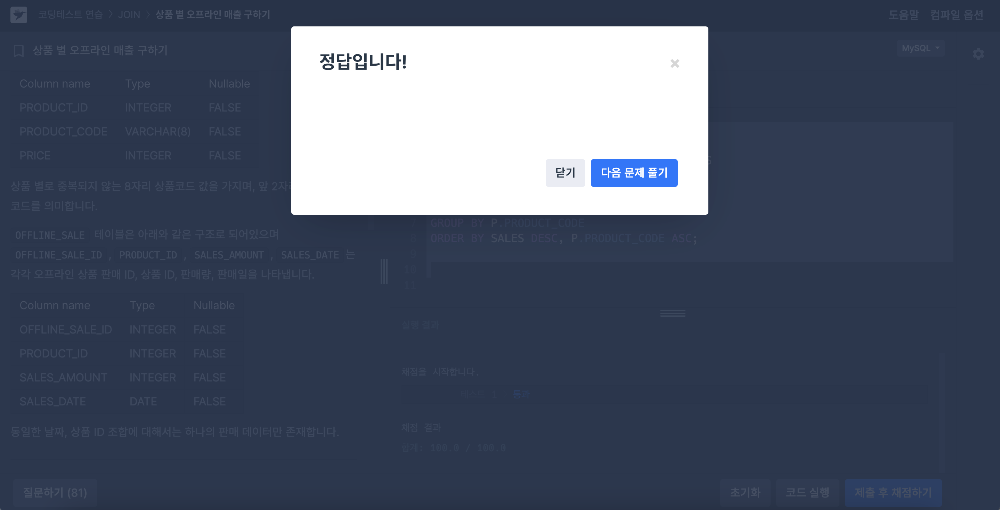
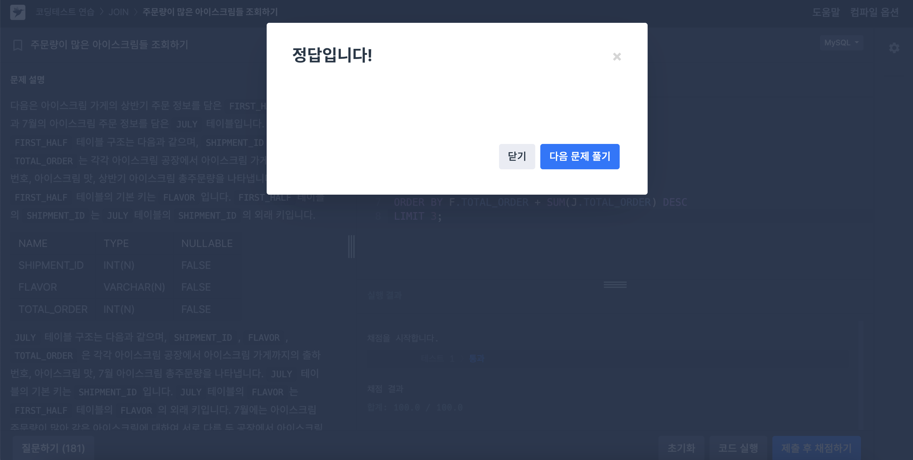

# SQL_BASIC 6주차 정규 과제 

📌SQL_BASIC 정규과제는 매주 정해진 분량의 `초보자를 위한 BigQuery(SQL) 입문` 강의를 듣고 간단한 문제를 풀면서 학습하는 것입니다. 이번주는 아래의 **SQL_Basic_6th_TIL**에 나열된 분량을 수강하고 `학습 목표`에 맞게 공부하시면 됩니다.

**6주차 과제는 강의 내용을 정리하는 것과 함께, 프로그래머스에서 제공하는 SQL 문제를 직접 풀어보는 실습도 병행합니다.** 강의에서는 **배운 내용을 정리하고 주요 쿼리 예제를 정리**하며, 프로그래머스 문제는 **직접 풀어본 뒤 풀이 과정과 결과, 배운 점을 함께 기록**해주세요. 완성된 과제는 Github에 업로드하고, 링크를 스프레드시트 'SQL' 시트에 입력해 제출해주세요.

**👀(수행 인증샷은 필수입니다.)** 

## SQL_BASIC_6th

### 섹션 6. 다량의 자료를 연결 : JOIN 

### 5-1. Intro

### 5-2. JOIN 이해하기

### 5-3. 다양한 JOIN 방법

### 5-4. JOIN 쿼리 작성하기 

### 5-5. JOIN을 처음 공부할 때 헷갈렸던 부분

### 5-6. JOIN 연습문제 1~2번

### 5-6. JOIN 연습문제 3~5번

### 5-7. 정리


## 🏁 강의 수강 (Study Schedule)

| 주차  | 공부 범위              | 완료 여부 |
| ----- | ---------------------- | --------- |
| 1주차 | 섹션 **1-1** ~ **2-2** | ✅         |
| 2주차 | 섹션 **2-3** ~ **2-5** | ✅         |
| 3주차 | 섹션 **2-6** ~ **3-3** | ✅         |
| 4주차 | 섹션 **3-4** ~ **4-4** | ✅         |
| 5주차 | 섹션 **4-4** ~ **4-9** | ✅         |
| 6주차 | 섹션 **5-1** ~ **5-7** | ✅         |
| 7주차 | 섹션 **6-1** ~ **6-6** | 🍽️         |

<!-- 여기까진 그대로 둬 주세요-->

<br>

---

# 1️⃣ 개념정리

## 5-2. JOIN 이해하기

~~~
✅ 학습 목표 :
* JOIN에 대한 정의와 필요성에 대해 설명할 수 있다.
~~~

### JOIN
: 서로 다른 데이터 테이블을 **연결**하는 것   
✔️ 공통적으로 존재하는 컬럼(**=key**)가 있다면 JOIN할 수 있음  
✔️ 보통 id값을 Key로 많이 사용하고, 특정 범위(ex: Date)로도 JOIN 가능

> ***포켓몬 데이터셋 예시***  
> `트레이너가 포획한 포켓몬` & `트레이너` 테이블  
> -> join key : `trainer_id`,`id`  

<br>

### JOIN을 해야하는 이유 
관계형 데이터베이스(RDBMS) 설계시 **정규화** 과정을 거침  
**정규화는 중복을 최소화하게 데이터를 구조화**   
(ex: User Table은 유저 데이터만, Order Table은 주문 데이터만)  

👉 즉, 데이터를 다양한 Table에 저장해서 필요할 때 JOIN해서 사용 


<br>
<br>
<br>
<br>

## 5-3. 다양한 JOIN 방법

~~~
✅ 학습 목표 :
* JOIN 방법들의 종류를 설명할 수 있다. 
* 각 JOIN 방법들의 차이점에 대해서 설명할 수 있다. 
~~~

### SQL JOIN 기법
- **`(INNER) JOIN`** : 두 테이블의 **공통** 요소만 연결
- **`LEFT/RIGHT(OUTER) JOIN`** : 왼쪽/오른쪽 테이블 기준으로 연결 
- **`FULL(OUTER) JOIN`** : 양쪽 기준으로 연결
- **`CROSS JOIN`** : 두 테이블의 **각각의 요소 곱하기**


<br>
<br>
<br>
<br>


## 5-4. JOIN 쿼리 작성하기 

~~~
✅ 학습 목표 :
* JOIN을 사용한 문법에 대해 이해하여 적용할 수 있다.
* JOIN 을 활용한 쿼리를 작성할 수 있다. 
~~~

### 쿼리 작성 흐름
1. **테이블 확인**
    : 테이블에 저장된 데이터, 컬럼 확인
2. **기준 테이블 정의**
    : 가장 많이 참고할 기준(Base) 테이블 정의
3. **JOIN Key 찾기**
    : 여러 테이블과 연결할 Key(ON) 정리
4. **결과 예상하기**
    : 결과 테이블을 예상해서 손, 엑셀로 작성 (일종의 정답지 역할)
5. **쿼리 작성 / 검증**
    : 예상한 결과와 동일한 결과가 나오는지 확인

<br>

### SQL JOIN 문법
: `FROM` 하단에 JOIN할 table 작성 & `ON` 뒤에 공통된 컬럼(Key)를 작성

```sql
SELECT
    A.col1,
    A.col2,
    B.col11,
    B.col12
FROM table1 AS A
LEFT JOIN table2 AS B
ON A.key = B.key
```
- `ON`절에서 Alias 사용가능 
- `CROSS JOIN` 제외하고는 모두 `ON` 필요

    ```sql
    SELECT
        col
    FROM table_a AS A
    CROSS JOIN table_b AS B
    ```
- `EXCEPT`: 서로 다른 테이블에 같은 컬럼명이 있어 중복될 때 SELECT 절에서 사용


<br>
<br>
<br>
<br>


## 5-6. JOIN 연습문제 1~5번 

~~~
✅ 학습 목표 :
* 연습문제(3문제 이상) 푼 것들 정리하기
~~~
> 1️⃣ **문제**   
> : 트레이너가 보유한 포켓몬들은 얼마나 있는지 알 수 있는 쿼리를 작성하세요
```sql
SELECT 
  kor_name,
  COUNT(tp.id) AS pokemon_cnt
FROM (
  SELECT
    id,
    trainer_id,
    pokemon_id,
    status
  FROM Basic.trainer_pokemon
  WHERE 
    status IN ("Active","Training")
) AS tp
LEFT JOIN Basic.pokemon AS p
ON tp.pokemon_id = p.id
GROUP BY kor_name
ORDER BY pokemon_cnt DESC
```
- `FROM`과 `WHERE`사이에 `JOIN`이 들어갈 수 있다
- 연산량 관점에서 **계산할 행(row)를 먼저 줄인 다음에 조인**하는 것이 적절
- `JOIN`에서 사용하는 테이블에 중복된 컬럼의 이름이 있으면 꼭 어떤 테이블의 컬럼인지 명시해야 함

<br>
<br>

> 2️⃣ **문제**   
> : 각 트레이너가 가진 포켓몬 중에서 'Grass' 타입의 포켓몬 수를 계산해 주세요(단 편의를 위해 type1 기준으로 계산해주세요)
```SQL
SELECT
  p.type1,
  COUNT(tp.id) AS CNT
FROM (
  SELECT 
    id,
    trainer_id,
    pokemon_id,
    status
  FROM Basic.trainer_pokemon
  WHERE 
    status IN ("Active","Training")
) AS tp
LEFT JOIN Basic.pokemon AS p
ON tp.pokemon_id = p.id
WHERE type1 = "Grass"
GROUP BY type1
ORDER BY 2 DESC
```

<br>
<br>

> 3️⃣ **문제**   
> : 트레이너의 고향(hometown)과 포켓몬을 포획한 위치(location)을 비교하여, 자신의 고향에서 포켓몬을 포획한 트레이너의 수를 계산해주세요
```sql
SELECT
  COUNT(DISTINCT tp.trainer_id) AS cnt
FROM Basic.trainer_pokemon AS tp
LEFT JOIN Basic.trainer AS t
ON t.id = tp.trainer_id
WHERE 
  tp.location IS NOT NULL
  AND tp.location = t.hometown
```
- LEFT에 메타 데이터 정보를 두면 헷갈릴 수 있음
- 만약 `SELECT`절에서 `DISTINCT`를 사용하지 않은 경우 트레이너와 포켓몬이 같은 건이 출력 not 트레이너의 수

<br>
<br>

> 4️⃣ **문제**   
> : MASTER 등급인 트레이너들은 어떤 타입의 포켓몬을 제일 많이 보유하고 있을까
```sql
SELECT 
  type1, 
  COUNT(tp.id) AS cnt
FROM (
SELECT
  id,
  trainer_id,
  pokemon_id,
  status
FROM Basic.trainer_pokemon
WHERE 
  status IN ("Active","Traning")
) AS tp
LEFT JOIN  Basic.pokemon AS p
ON tp.pokemon_id = p.id
LEFT JOIN Basic.trainer AS t
ON tp.trainer_id = t.id
WHERE t.achievement_level = "Master"
GROUP BY type1
ORDER BY 2 DESC
```
- `LEFT JOIN`을 2번 연속해서 쓰는 것 가능

<br>
<br>

> 5️⃣ **문제**   
> : Incheon 출신 트레이너들은 1세대, 2세대 포켓몬을 각각 얼마나 보유하고 있나요?

```sql
SELECT
  generation,
  COUNT(tp.id) AS cnt
FROM ( 
  SELECT 
    id, 
    trainer_id, 
    pokemon_id, 
    status
  FROM Basic.trainer_pokemon
  WHERE status IN ("Active","Training")
) AS tp
LEFT JOIN Basic.trainer AS t
ON tp.trainer_id = t.id
LEFT JOIN Basic.pokemon AS p
ON tp.trainer_id = p.id
WHERE
  t.hometown = "Incheon"
GROUP BY generation
```
<br>
<br>
<br>
<br>


---

# 2️⃣ 확인문제 & 문제 인증

## 프로그래머스 문제 

https://school.programmers.co.kr/learn/courses/30/lessons/131533

> 상품 별 오프라인 매출 구하기   



https://school.programmers.co.kr/learn/courses/30/lessons/133027

> 주문량이 많은 아이스크림들 조회하기  




---

# 3️⃣ 참고자료

JOIN 에 대해서 그림으로 쉽게 이해할 수 있는 자료들도 있어서 첨부합니다. 아래의 블로그도 학습할 때 같이 참고해주세요.

1. https://data-marketing-bk.tistory.com/entry/SQL-JOIN-%ED%95%9C-%EB%B0%A9%EC%97%90-%EC%A0%95%EB%A6%AC-%EA%B0%9C%EB%85%90%EB%B6%80%ED%84%B0-%EC%BD%94%EB%93%9C%EA%B9%8C%EC%A7%80-%EC%9D%B4%EA%B2%83%EB%A7%8C-%EB%B3%B4%EC%9E%90


2. https://velog.io/@wijoonwu/JOIN

<br>

### 🎉 수고하셨습니다.
